# Pollution Monitoring and Reporting System

## Project Specification

### Overview
Air pollution is a critical environmental and public health issue. This project aims to build a Pollution Monitoring and Reporting System that aggregates real-time and historical air quality data to provide actionable insights.

## Motivation

Air pollution is a growing global concern, with serious implications for public health, environmental sustainability, and climate change. Real-time and historical air quality data play a crucial role in understanding pollution patterns, identifying high-risk areas, and developing effective mitigation strategies. However, many organizations struggle with fragmented data sources, inconsistent data quality, and the challenge of integrating real-time and batch data efficiently.

This capstone project aims to address these challenges by developing a Pollution Monitoring and Reporting System leveraging Databricks' end-to-end data processing capabilities. By aggregating air quality data from multiple sources, including OpenAQ and NOAA's weather data, and integrating real-time data ingestion using Kafka and Spark Streaming, the project will enable near real-time analysis and long-term trend evaluation.

Through the use of Delta Tables, Databricks SQL Warehouse, and automated ETL pipelines, this project seeks to provide a unified, scalable, and high-performance solution for analyzing pollution levels and their correlation with weather conditions. The goal is to facilitate data-driven decision-making for policymakers, researchers, and environmental agencies, ultimately contributing to improved air quality management and public health outcomes.

## Project Scope

- **Ingesting historical data** from OpenAQ (pollution) and NOAA (weather).
- **Processing data** using Databricks Workflows and Delta Tables.
- **Streaming real-time data** from OpenAQ API using Kafka Confluent and Spark Structured Streaming.
- **Storing and managing data** in Databricks with partitioning and optimization.
- **Analyzing and visualizing data** using Databricks SQL Warehouse and dashboards.

## Expected Outputs
- Unified dataset combining real-time and historical air quality data.
- Automated ETL pipelines with data validation and monitoring.
- Analytical dashboards showcasing pollution trends and insights.
- Documentation on data sources, transformations, and data model.

## High level Architecture Diagram

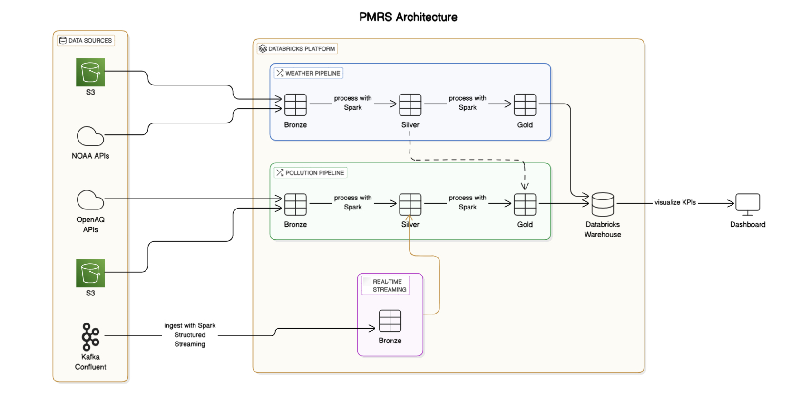

## Dataset and Technology Choices

### Datasets
- **OpenAQ Public Dataset**: Real-time air quality data (PM2.5, PM10, NO2, SO2, CO, O3).
- **National Centers for Environmental Information (NCEI)**: Historical meteorological data (temperature, wind speed, humidity).

### Technology Stack
| Component           | Technology Used |
|---------------------|----------------|
| **Data Ingestion**  | Kafka, API Calls |
| **Data Processing** | Apache Spark, Databricks |
| **Storage**        | Delta Tables, Databricks SQL Warehouse |
| **Orchestration**  | Databricks Workflows |
| **Visualization**  | Databricks Dashboards |
| **Programming**    | Python |

### Justifications
- **Kafka**: Handles real-time streaming data ingestion.

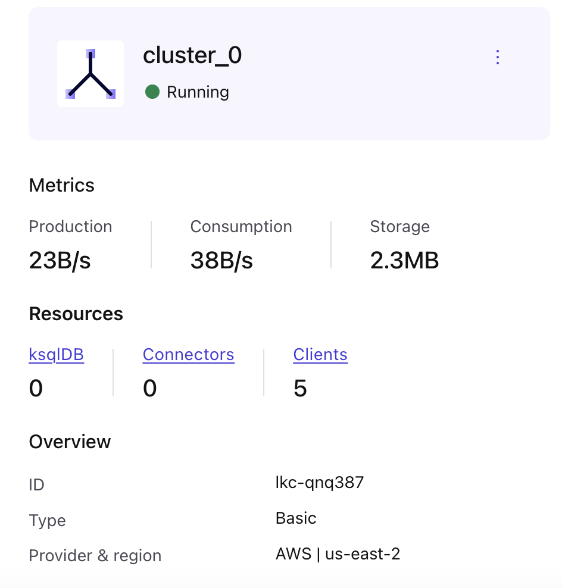

- **Delta Tables**: Ensures scalable, ACID-compliant storage.

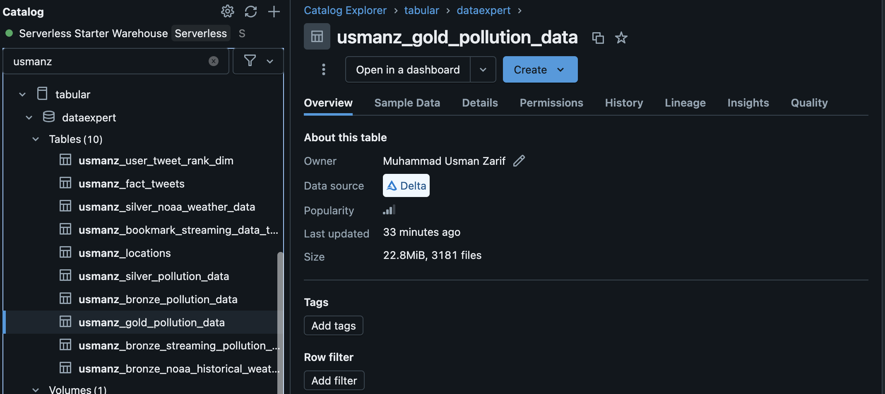

- **Databricks SQL Warehouse**: Enables fast analytical queries.

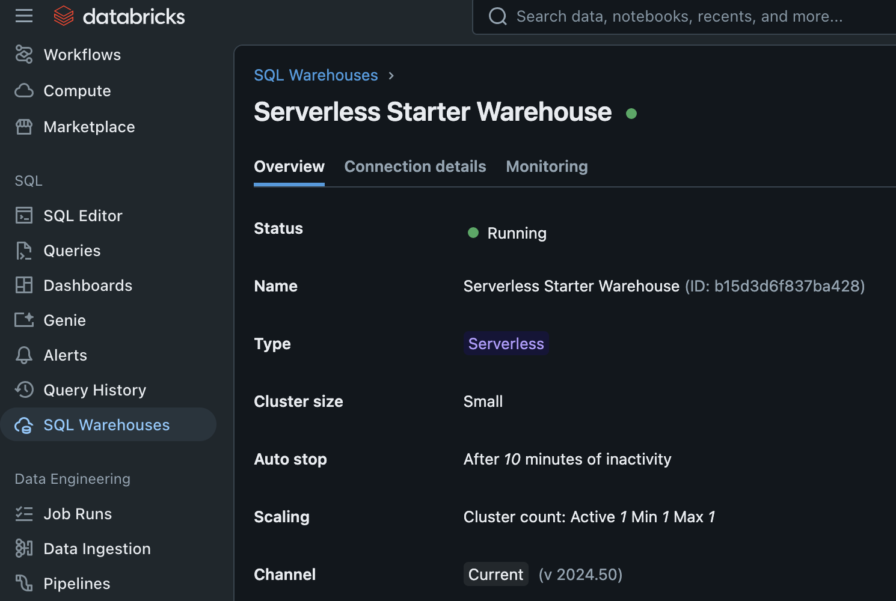

- **Apache Spark**: Efficient large-scale data processing.

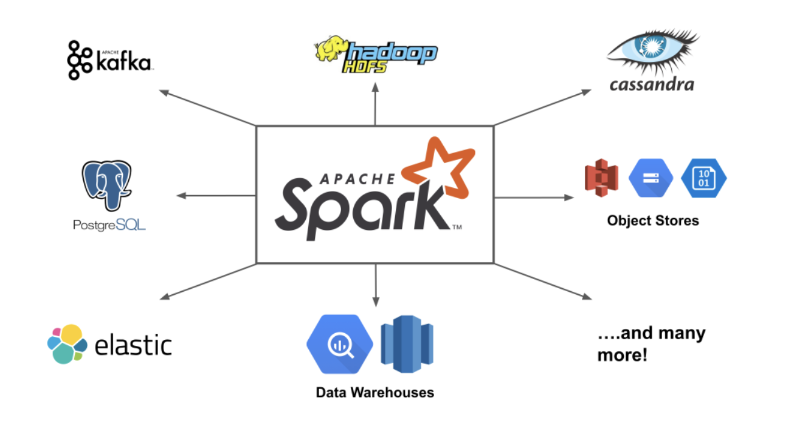

- **Databricks Workflows**: Automates and schedules ETL tasks.

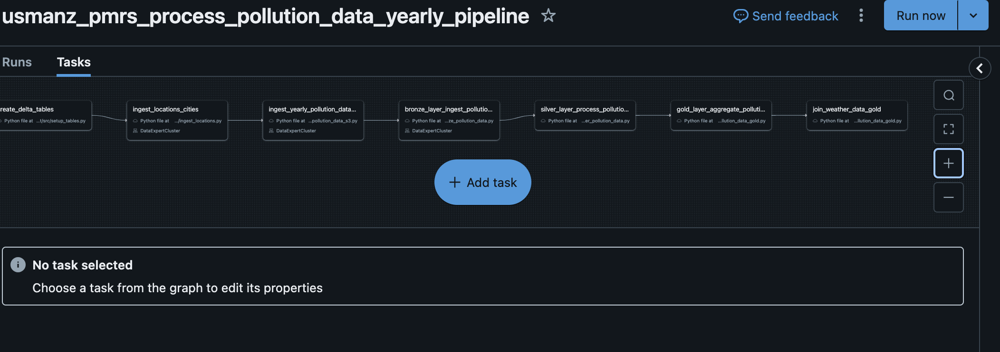

- **Databricks Dashboards**: Provides intuitive data visualization.

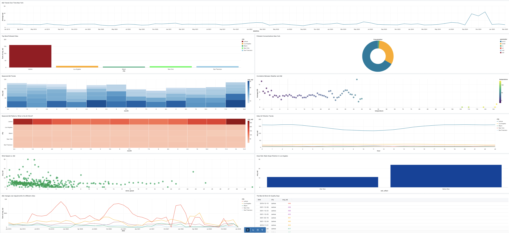

## Databricks Workflows(ETL Runs)
The ETL process is orchestrated using three Databricks workflows:

### 1. Pollution Data Workflow
- **Ingestion**: Downloads yearly pollution data from S3 and loads it into the bronze layer.
- **Processing**:
  - Cleans and enriches the data in the silver layer.
  - Aggregates and generates key metrics in the gold layer.
- **Integration**: The gold pollution data is later joined with processed weather data to identify correlations.

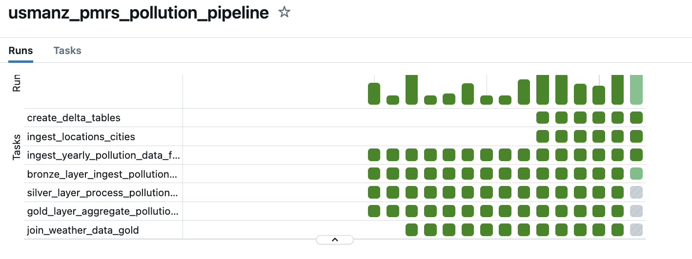

### 2. Weather Data Workflow
- **Station Data**: Fetches station metadata and stores it in the bronze layer.
- **Ingestion**: Downloads yearly weather data for the stations and loads it into the bronze layer.
- **Processing**:
  - Cleans and structures the data in the silver layer.
  - Aggregates and generates weather-based insights in the gold layer.
- **Integration**: The silver weather data is joined with gold pollution data to analyze trends and correlations.

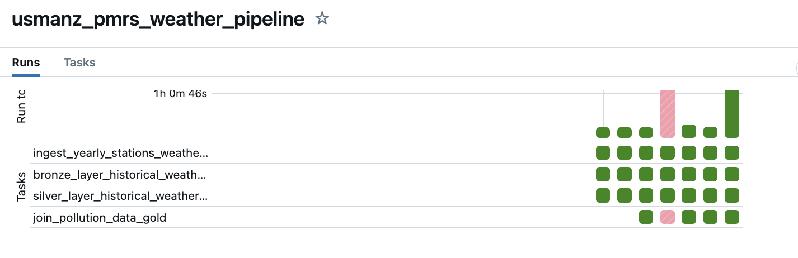

### 3. Streaming Data Workflow
- **Ingestion**:
  - Real-time pollution data is ingested from OpenAQ using Kafka.
  - Data is processed and stored in a Delta bronze table.
- **Processing**:
  - Data is cleaned and standardized in the silver layer.
  - Unified with pollution data from the batch workflow to maintain consistency.
- **Final Integration**:
  - The unified dataset is loaded into the gold layer for analytics and reporting.

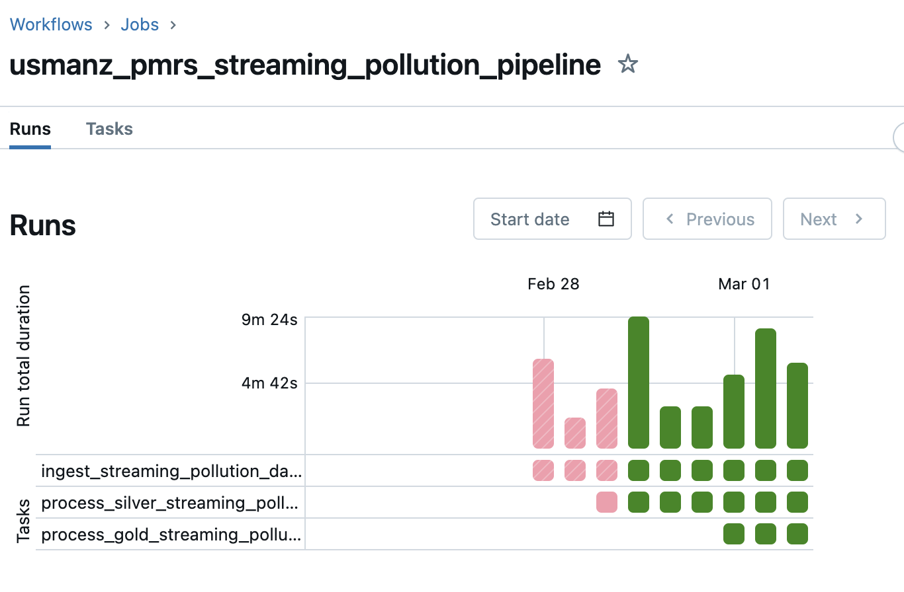

### Data Processing Layers
- **Bronze Layer**: Raw data storage in Delta format.
- **Silver Layer**: Cleaned, structured data with transformations applied.
- **Gold Layer**: Aggregated and enriched data for analysis and visualization.

# Data Quality Checks in Pollution Data Processing

This outlines the data quality checks performed at various stages in the pollution data processing pipeline.

## Data Quality Checks Overview

| **Check Category**    | **Description** | **Implemented In** |
|----------------------|---------------|------------------|
| **Missing Data**     | Rows with null values in critical fields (`location`, `sensors_id`, `datetime`) are removed. | Bronze to Silver Transformation |
| **Deduplication**    | Keeps only the latest record based on `ingestion_timestamp` or `kafka_ingestion_timestamp`. | Bronze to Silver, Streaming to Silver |
| **Negative Values**  | Sets `value` to 0 if it is negative. | Bronze to Silver, Streaming to Silver |
| **Latitude & Longitude Validation** | Sets `lat` and `lon` to NULL if they are outside valid ranges (-90 to 90 for latitude, -180 to 180 for longitude). | Bronze to Silver, Streaming to Silver |
| **Filling Missing Values** | Replaces NULL `units` with 'unknown'. | Bronze to Silver, Streaming to Silver |
| **Rounding Values**  | Rounds `lat`, `lon` to 5 decimal places and `value` to 3 decimal places for consistency. | Bronze to Silver, Streaming to Silver |
| **Partitioning & Filtering** | Data is filtered based on country, city, and year to optimize querying. | Bronze to Silver Transformation |
| **Incremental Processing** | Streaming data processing ensures only new records beyond the last processed Kafka offset are considered. | Streaming to Silver Transformation |
| **Merge Strategy**   | Updates existing records in the Silver table and inserts new ones. | Streaming to Silver Transformation |
| **Bookmarking**      | Stores the latest processed Kafka offset to avoid duplicate processing. | Streaming to Silver Transformation |

## Detailed Description of Checks

### 1. Handling Missing Data
- Ensures critical fields (`location`, `sensors_id`, `datetime`) are present.
- Rows with missing values in these fields are removed to maintain data integrity.

### 2. Deduplication
- Uses **row_number()** with a partition by `location`, `sensors_id`, and `datetime`.
- Keeps only the latest record based on `ingestion_timestamp` (for batch) or `kafka_ingestion_timestamp` (for streaming).

### 3. Fixing Negative Values
- If `value < 0`, it is replaced with `0` to prevent incorrect pollutant readings.

### 4. Latitude & Longitude Validation
- `lat` values are set to NULL if they are not in the range **-90 to 90**.
- `lon` values are set to NULL if they are not in the range **-180 to 180**.

### 5. Filling Missing Units
- If `units` is NULL, it is replaced with **'unknown'**.

### 6. Rounding Values
- `lat` and `lon` are rounded to **5 decimal places**.
- `value` is rounded to **3 decimal places**.

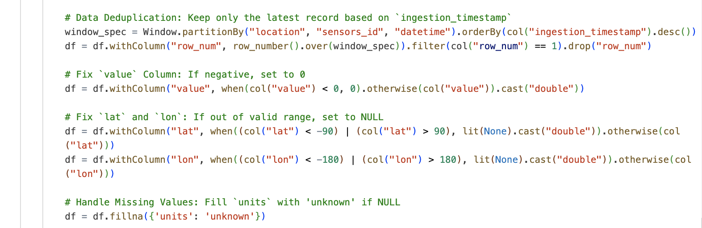
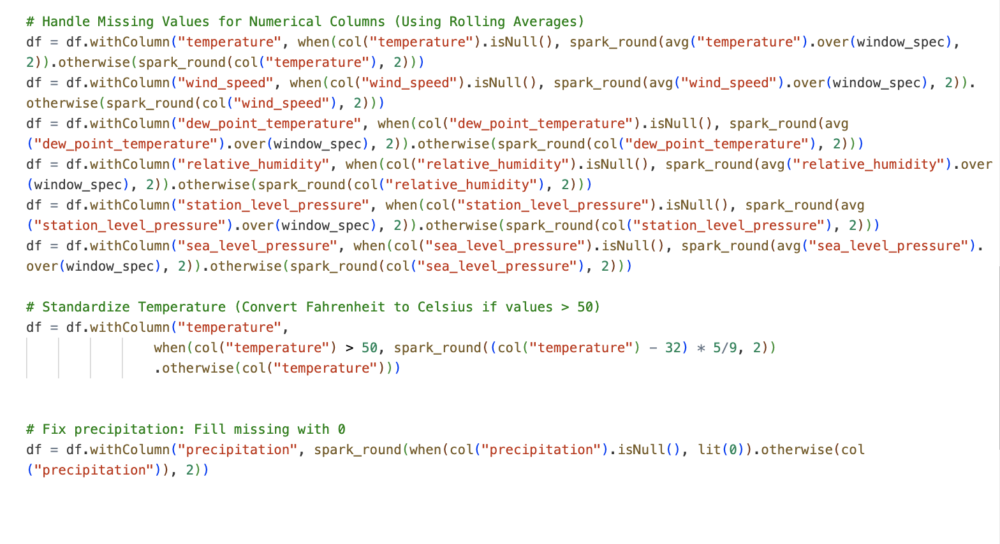

### 7. Partitioning and Filtering
- Data is partitioned by **country, city, year, month, day**.
- Processing is optimized by filtering based on available countries, cities, and years.

### 8. Incremental Processing in Streaming Data
- Reads only new data where `kafka_offset` > last processed offset.
- Ensures that previously processed records are not duplicated.

### 9. Merge Strategy for Silver Table
- **When Matched:** Updates existing records with new values.
- **When Not Matched:** Inserts new records.

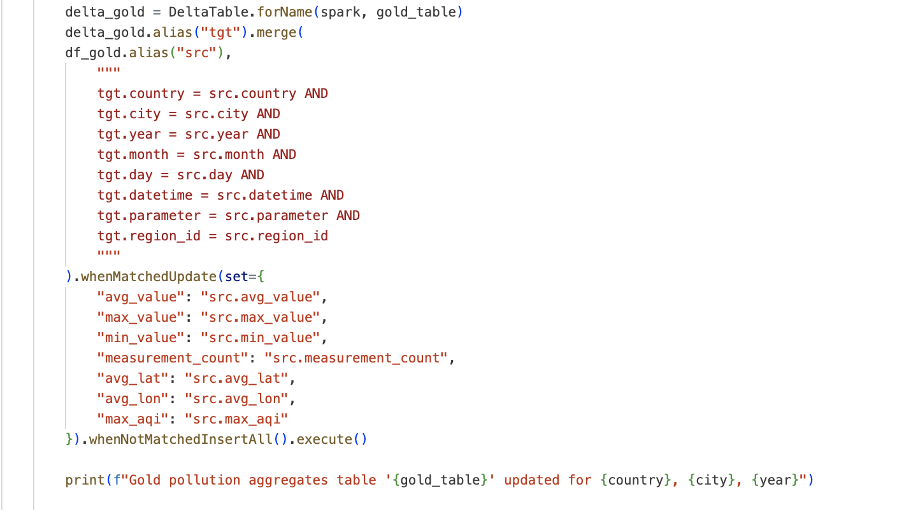

### 10. Bookmarking for Kafka Streams
- Stores the latest processed Kafka offset in a bookmark table.
- Ensures only unprocessed records are ingested in subsequent runs.

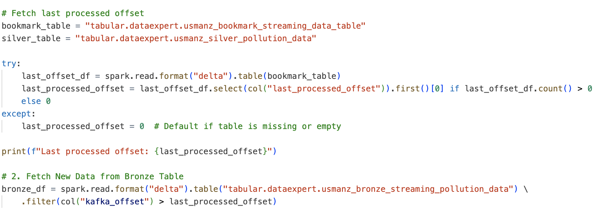

# Pollution Monitoring Dashboards

## AQI Trends Over Time  
Tracks average AQI changes over time for a selected city.

## Top Polluted Locations  
Lists the cities with the highest average AQI.  

## Pollutant Concentration Levels  
Shows average and peak pollutant concentrations in a city.  

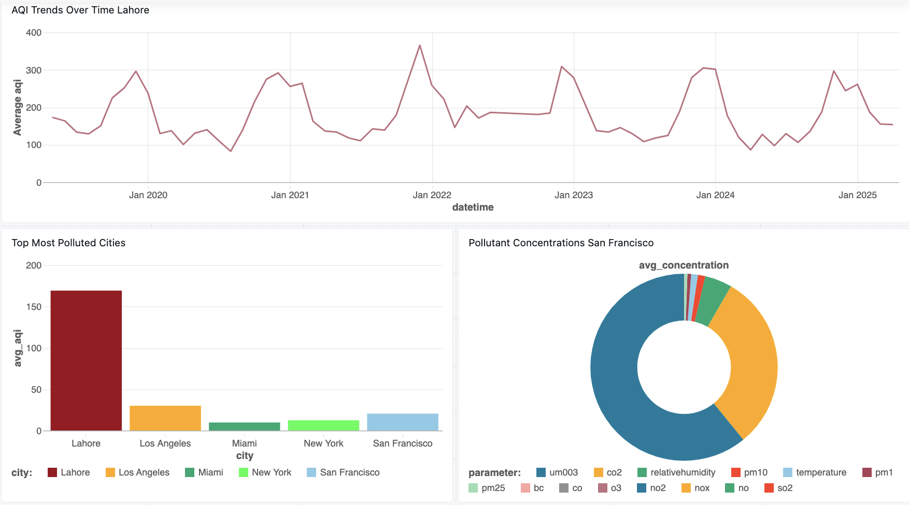

## Seasonal AQI Trends  
Analyzes AQI variations across different months and years.  

## Correlation Between Weather and AQI  
Examines how temperature, wind speed, and precipitation affect AQI.  

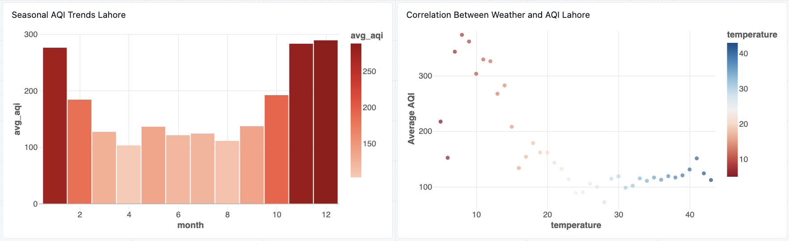

## AQI Heatmap  
Displays AQI variations by city and month.  

## Pollution Levels by Time of Day  
Reveals how AQI fluctuates at different hours of the day.  

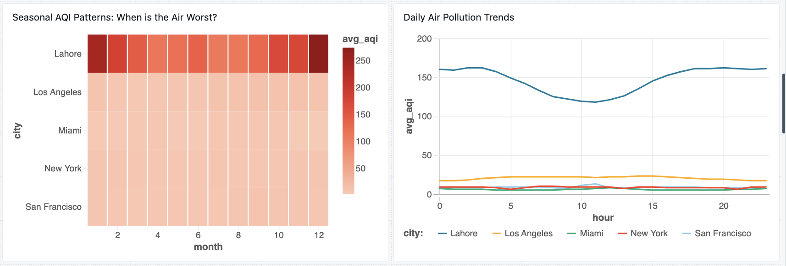

## Wind Speed vs. AQI  
Analyzes the relationship between wind speed and air pollution levels.  

## Does Rain Wash Away Pollution in Los Angeles?  
Compares AQI before and after rainfall to assess its impact.  

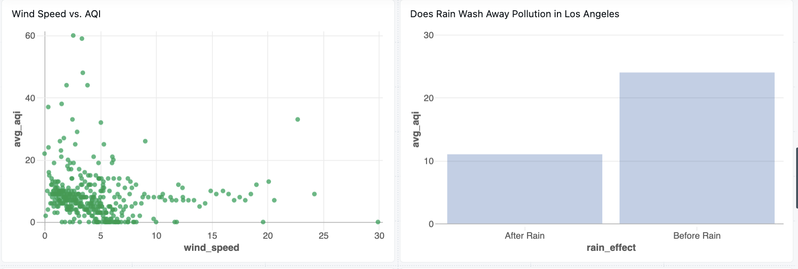

## AQI Changes Over Days/Months for Different Cities  
Shows daily and monthly AQI trends across multiple cities.  

## The Best & Worst Air Quality Days  
Highlights the best and worst AQI days in different cities.  

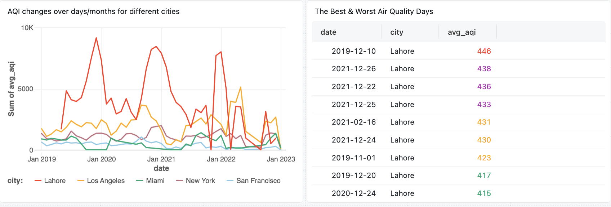

## Pollution Intensity Heatmap (City-Level)  
Maps AQI intensity based on latitude and longitude.  

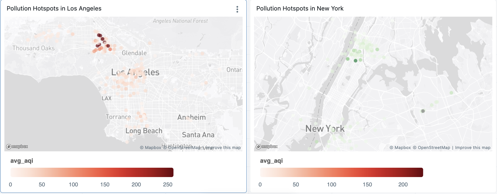

## Schemas

#### `locations`
| Column Name       | Data Type  | Description |
|-------------------|-----------|-------------|
| location_id      | STRING    | Unique ID for the location |
| location_name    | STRING    | Name of the location |
| locality         | STRING    | Locality of the location |
| city            | STRING    | City where the location is situated |
| timezone        | STRING    | Timezone of the location |
| country         | STRING    | Country of the location |
| provider_id     | STRING    | ID of the data provider |
| provider_name   | STRING    | Name of the data provider |
| is_mobile       | BOOLEAN   | Whether the location is mobile |
| is_monitor      | BOOLEAN   | Whether the location has monitoring capabilities |
| latitude        | DOUBLE    | Latitude coordinate |
| longitude       | DOUBLE    | Longitude coordinate |
| bbox           | STRING    | Bounding box representing location coverage |
| sensor_id       | STRING    | ID of the sensor |
| sensor_name     | STRING    | Name of the sensor |
| parameter       | STRING    | Air quality parameter measured |
| datetime_first  | TIMESTAMP | First recorded data timestamp |
| datetime_last   | TIMESTAMP | Last recorded data timestamp |
| ingestion_time  | TIMESTAMP | Timestamp when data was ingested |

#### `bronze_noaa_historical_weather_data`
| Column Name               | Data Type  | Description |
|---------------------------|-----------|-------------|
| station_id                | STRING    | Unique ID for the weather station |
| station_name              | STRING    | Name of the weather station |
| date                      | TIMESTAMP | Measurement date |
| latitude                  | DOUBLE    | Latitude coordinate |
| longitude                 | DOUBLE    | Longitude coordinate |
| elevation                 | DOUBLE    | Elevation of the station |
| temperature               | DOUBLE    | Recorded temperature |
| dew_point_temperature     | DOUBLE    | Dew point temperature |
| relative_humidity         | DOUBLE    | Relative humidity level |
| wind_speed                | DOUBLE    | Wind speed |
| wind_direction            | INT       | Wind direction in degrees |
| precipitation             | DOUBLE    | Precipitation level |
| station_level_pressure    | DOUBLE    | Atmospheric pressure at station level |
| sea_level_pressure        | DOUBLE    | Atmospheric pressure at sea level |
| country                   | STRING    | Country of the station |
| city                      | STRING    | City of the station |
| year                      | INT       | Year of measurement |
| month                     | INT       | Month of measurement |
| day                       | INT       | Day of measurement |
| ingestion_date            | TIMESTAMP | Timestamp when data was ingested |

#### `bronze_pollution_data`
| Column Name       | Data Type  | Description |
|-------------------|-----------|-------------|
| location_id      | STRING    | Unique ID for the location |
| sensors_id      | STRING    | ID of the sensor |
| location        | STRING    | Name of the location |
| datetime        | TIMESTAMP | Measurement timestamp |
| lat            | DOUBLE    | Latitude coordinate |
| lon            | DOUBLE    | Longitude coordinate |
| parameter      | STRING    | Air quality parameter measured |
| units          | STRING    | Measurement units |
| value          | DOUBLE    | Measured value |
| country        | STRING    | Country of the location |
| city          | STRING    | City of the location |
| year          | INT       | Year of measurement |
| month         | INT       | Month of measurement |
| day           | INT       | Day of measurement |
| ingestion_timestamp | TIMESTAMP | Timestamp when data was ingested |
| source_file   | STRING    | Source file of the data |

### `bronze_streaming_pollution_data`
| Column Name       | Data Type  |
|-------------------|-----------|
| location_id      | STRING    |
| sensors_id      | STRING    |
| datetime        | TIMESTAMP |
| location        | STRING    |
| lat            | DOUBLE    |
| lon            | DOUBLE    |
| bbox           | STRING    |
| parameter      | STRING    |
| value          | DOUBLE    |
| units          | STRING    |
| country        | STRING    |
| city          | STRING    |
| year          | INT       |
| month         | INT       |
| day           | INT       |
| kafka_offset  | BIGINT    |
| kafka_partition | INT     |
| kafka_ingestion_timestamp | TIMESTAMP |
| ingestion_time | TIMESTAMP |

### `bookmark_streaming_data_table`
| Column Name       | Data Type  |
|-------------------|-----------|
| table_name       | STRING    |
| last_processed_offset | BIGINT |

### `silver_pollution_data`
| Column Name       | Data Type  |
|-------------------|-----------|
| location_id      | STRING    |
| sensors_id      | STRING    |
| location        | STRING    |
| datetime        | TIMESTAMP |
| lat            | DOUBLE    |
| lon            | DOUBLE    |
| parameter      | STRING    |
| units          | STRING    |
| value          | DOUBLE    |
| country        | STRING    |
| city          | STRING    |
| year          | INT       |
| month         | INT       |
| day           | INT       |
| ingestion_timestamp | TIMESTAMP |
| source_file   | STRING    |

### `silver_noaa_weather_data`
| Column Name       | Data Type  |
|-------------------|-----------|
| station_id       | STRING    |
| station_name    | STRING    |
| date           | TIMESTAMP |
| latitude       | DOUBLE    |
| longitude      | DOUBLE    |
| elevation      | DOUBLE    |
| temperature    | DOUBLE    |
| dew_point_temperature | DOUBLE |
| relative_humidity | DOUBLE |
| wind_speed     | DOUBLE    |
| wind_direction | INT       |
| precipitation  | DOUBLE    |
| station_level_pressure | DOUBLE |
| sea_level_pressure | DOUBLE |
| country        | STRING    |
| city          | STRING    |
| year          | INT       |
| month         | INT       |
| day           | INT       |
| ingestion_date | TIMESTAMP |

### `gold_pollution_data`
| Column Name       | Data Type  |
|-------------------|-----------|
| region_id       | STRING    |
| datetime       | TIMESTAMP |
| parameter      | STRING    |
| avg_value      | DOUBLE    |
| max_value      | DOUBLE    |
| min_value      | DOUBLE    |
| max_aqi        | INT       |
| measurement_count | INT    |
| avg_lat        | DOUBLE    |
| avg_lon        | DOUBLE    |
| region_min_lat | DOUBLE    |
| region_max_lat | DOUBLE    |
| region_min_lon | DOUBLE    |
| region_max_lon | DOUBLE    |
| country        | STRING    |
| city          | STRING    |
| year          | INT       |
| month         | INT       |
| day           | INT       |

### `gold_weather_pollution_data`
| Column Name       | Data Type  |
|-------------------|-----------|
| region_id       | STRING    |
| datetime       | TIMESTAMP |
| parameter      | STRING    |
| avg_value      | DOUBLE    |
| max_value      | DOUBLE    |
| min_value      | DOUBLE    |
| max_aqi        | INT       |
| measurement_count | INT    |
| avg_lat        | DOUBLE    |
| avg_lon        | DOUBLE    |
| region_min_lat | DOUBLE    |
| region_max_lat | DOUBLE    |
| region_min_lon | DOUBLE    |
| region_max_lon | DOUBLE    |
| station_id     | STRING    |
| station_lat    | DOUBLE    |
| station_lon    | DOUBLE    |
| temperature    | DOUBLE    |
| dew_point_temperature | DOUBLE |
| relative_humidity | DOUBLE |
| wind_speed     | DOUBLE    |
| wind_direction | INT       |
| precipitation  | DOUBLE    |
| station_level_pressure | DOUBLE |
| sea_level_pressure | DOUBLE |
| country        | STRING    |
| city          | STRING    |
| year          | INT       |
| month         | INT       |
| day           | INT       |

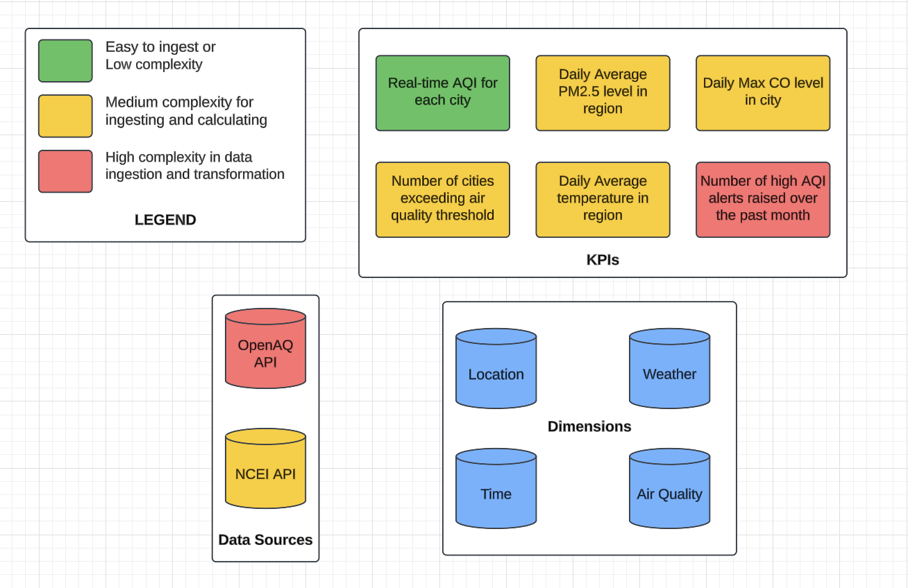

## Steps Followed and Challenges Faced

### Steps Followed
1. **Data Ingestion**
   - Real-time ingestion via Kafka.
   - Batch ingestion from NCEI,OPENAQ S3/API.
2. **Data Cleaning & Transformation**
   - Standardizing schemas.
   - Handling missing/inconsistent data.
3. **Data Storage & Processing**
   - Storing raw data in Delta Tables.
   - Transforming data for analytics.
4. **Data Quality Checks**
   - Ensuring completeness and accuracy.
   - Validating timestamps and geolocations.
5. **Data Visualization & Reporting**
   - Creating dashboards to track AQI trends and correlations.

### Challenges Faced
- **Processing Hourly Data**: Handling high-frequency data ingestion and transformations.
- **Correlation Analysis**: Joining hourly pollution and weather data efficiently for insights.
- **Data Quality Issues**: Missing values, inconsistent locations.
- **API Rate Limits**: Implementing retries and caching strategies.
- **Large Data Volumes**: Optimizing Delta Tables for efficient querying.

## Future Enhancements
- **Expand Data Sources**: Integrate more air quality and meteorological datasets.
- **Real-time Alerts**: Implement anomaly detection for pollution spikes.
- **Advanced Analytics**: Use ML models for predictive air quality forecasting.
- **Interactive Dashboards**: Enhance visualization capabilities with more filters and drill-down options.

